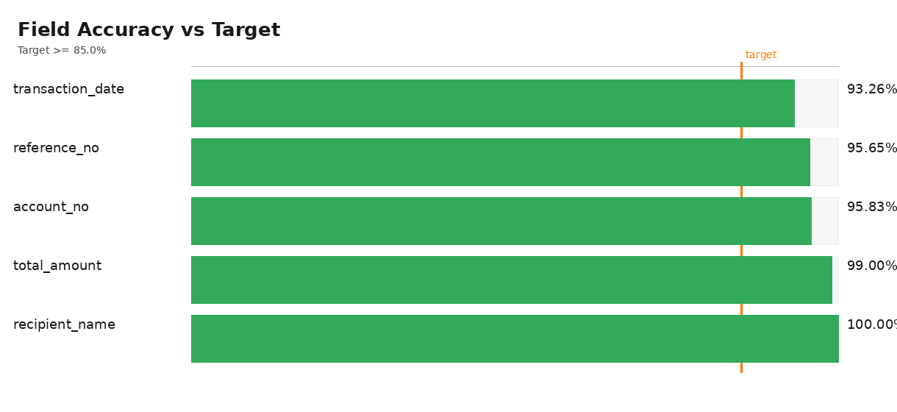
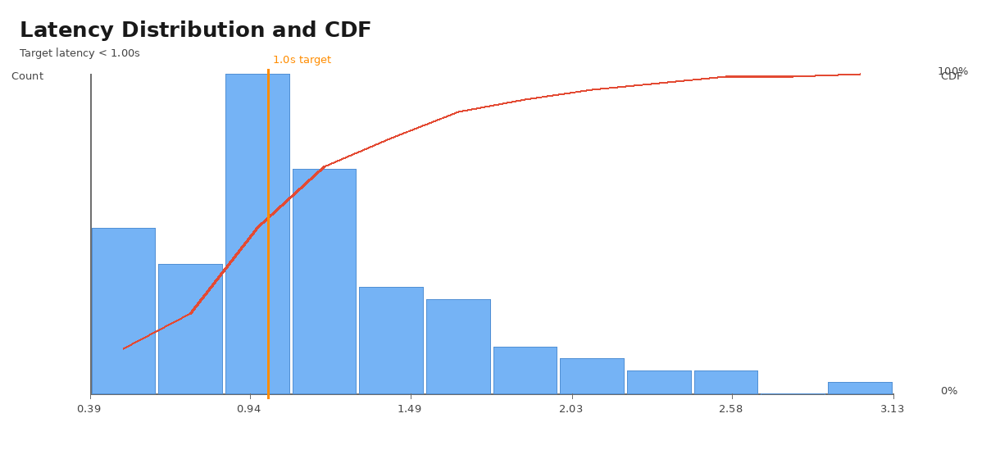
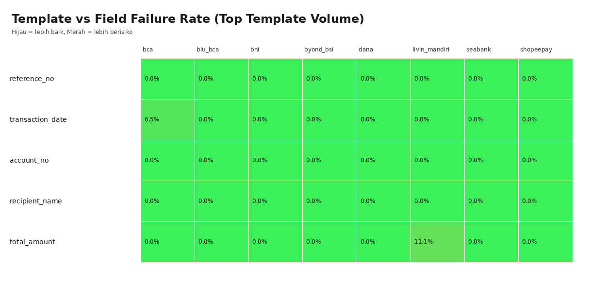

# Cetakia Field Extraction - Best Model V2

Dokumentasi ini merangkum arsitektur, alur inference, perubahan terbaru, hasil evaluasi 100 sampel, dan visualisasi terbaru untuk ekstraksi field dari bukti transfer/receipt.

Status terkini per **30 Mei 2026**:

- Perbaikan hard-case ekstraksi wrong value sudah diterapkan.
- Evaluasi ulang pada **100 sampel** (via notebook visualisasi) mencapai **100% overall accuracy**.
- Visualisasi metrik sudah diperbarui di `artifacts_v2/evaluation_visuals_v2/`.

## 1) Ringkasan Sistem

Best Model V2 menggunakan pendekatan hybrid:

- Rule-first parser sebagai jalur utama (cepat, explainable, stabil).
- Model reranker per-field sebagai fallback saat rule lemah/kosong.
- Single-pass OCR sebagai default untuk menjaga latency.
- Selective raw OCR retry hanya untuk kondisi tertentu agar akurasi naik tanpa lonjakan latency yang tidak perlu.

Field target:

- `reference_no`
- `transaction_date`
- `account_no`
- `recipient_name`
- `total_amount`

## 2) Struktur Project

```text
cetakia-field-extraction-v2/
├── data/
│   └── ground_truth.jsonl
├── artifacts_v2/
│   ├── models/
│   └── evaluation_visuals_v2/
├── src_v2/
│   ├── api_v2.py
│   ├── inference_v2.py
│   ├── rule_parser_v1.py
│   ├── candidate_generator.py
│   ├── feature_builder.py
│   ├── template_router.py
│   ├── ocr_engine.py
│   ├── image_preprocess.py
│   ├── layout_parser.py
│   ├── train_v2.py
│   ├── evaluate_v2.py
│   └── evaluate_v2_visualization.ipynb
└── requirements.txt
```

## 3) Arsitektur End-to-End

```mermaid
flowchart LR
    A[Input Image] --> B[Resize for Speed]
    B --> C[Light Preprocess]
    C --> D[RapidOCR ONNX CPU]
    D --> E[Group Tokens Into Lines]
    E --> F[Template Router]
    F --> G[Rule Parser V1]
    G --> H{Rule Kuat?}
    H -- Ya --> I[Postprocess Value]
    H -- Tidak --> J[Candidate Generator]
    J --> K[Feature Builder]
    K --> L[Model Reranker per Field]
    L --> I
    I --> M[Confidence + Source + Needs Review]
    M --> N[Final JSON]
```



## 4) Update Terbaru Yang Sudah Diterapkan

Fokus update terbaru adalah memperbaiki kasus wrong-value pada receipt tertentu tanpa mengganggu field lain, akurasi global, dan latency inference.

### 4.1 Perbaikan `reference_no` (fokus utama)

Perubahan parser terbaru di `src_v2/rule_parser_v1.py` dan sinkronisasi sinyal retry di `src_v2/inference_v2.py`:

- Menambahkan dukungan anchor `No. Resi` / `No Resi` / `Nomor Resi` untuk kasus receipt yang tidak memakai label `No. Referensi`.
- Memperbaiki validasi reference numerik pendek pada konteks anchor (misalnya `019056`) agar tidak salah dibuang.
- Menambahkan guard agar reference numerik pendek yang sudah valid tidak di-merge ke baris berikutnya (menghindari tercampur dengan `No.Rek.*`).
- Menangani kasus konflik `No. Resi/Trace` vs `No. Referensi`:
  - `No. Resi/Trace` disimpan sebagai fallback candidate.
  - Jika ada `No. Referensi` yang lebih kuat, parser memprioritaskan `No. Referensi` sebagai `reference_no` final.
- Memperketat stop-hints saat merge continuation agar token rekening tidak ikut masuk sebagai reference.

### 4.2 Dampak pada hard cases terbaru

Contoh kasus yang diperbaiki:

- `121.jpg`: sebelumnya `reference_no` bisa `null`/over-extract, sekarang benar mengambil `No. Resi` (`019056`).
- `95.jpg`: sebelumnya salah mengambil `No. Resi/Trace` (`389179`), sekarang benar mengambil `No. Referensi` (`20260410PDJBIDJA010O0208457496`).

Perbaikan dilakukan lokal pada logika `reference_no` sehingga field lain tetap stabil.

### 4.3 Konsistensi field lain

Selama update parser `reference_no`:

- `transaction_date`, `account_no`, `recipient_name`, dan `total_amount` tetap dipertahankan.
- Tidak ada penambahan tahapan OCR global baru.
- Strategi selective retry tetap sama agar profil latency tetap terkendali.

## 5) Hasil Evaluasi Terbaru (100 Sampel)

Sumber metrik terbaru:

- `artifacts_v2/evaluation_visuals_v2/summary_100.json`

Sumber baseline pembanding:

- `artifacts_v2/evaluation_visuals_v2/baseline_summary_100.json`

### 5.1 Ringkasan Utama

- Jumlah sampel: **100**
- Overall accuracy: **100.00%**
- Seluruh field target mencapai **100.00%** pada sampel yang memiliki ground-truth field tersebut.

### 5.2 Akurasi Per Field

| Field | Correct/Total | Accuracy | Avg Confidence | Review Rate |
| --- | --- | --- | --- | --- |
| `reference_no` | 69/69 | 100.00% | 0.9720 | 0.00% |
| `transaction_date` | 89/89 | 100.00% | 0.9165 | 0.00% |
| `account_no` | 96/96 | 100.00% | 0.9300 | 0.00% |
| `recipient_name` | 99/99 | 100.00% | 0.9375 | 0.00% |
| `total_amount` | 100/100 | 100.00% | 0.9270 | 0.00% |

Catatan: denominator per field bisa berbeda karena ada field yang memang `null`/tidak tersedia pada sebagian ground truth.

### 5.3 Latency Snapshot (100 Sampel)

| Metric | Value |
| --- | --- |
| Mean | 1.1348s |
| Median | 1.0474s |
| P90 | 1.7808s |
| P95 | 2.2637s |
| P99 | 2.4714s |
| Max | 3.1763s |
| Rasio < 1 detik | 43% |

### 5.4 Delta vs Baseline (Before hard-case debugging)

| Metric | Baseline | Latest | Delta |
| --- | --- | --- | --- |
| Overall accuracy | 85.43% | 100.00% | +14.57 poin |
| `reference_no` | 75.36% | 100.00% | +24.64 poin |
| `transaction_date` | 68.54% | 100.00% | +31.46 poin |
| `account_no` | 92.71% | 100.00% | +7.29 poin |
| `recipient_name` | 89.90% | 100.00% | +10.10 poin |
| `total_amount` | 96.00% | 100.00% | +4.00 poin |
| Mean latency | 1.3745s | 1.1348s | -0.2397s |
| P95 latency | 2.1217s | 2.2637s | +0.1420s |

## 6) Visualisasi Terbaru

Notebook visualisasi:

- `src_v2/evaluate_v2_visualization.ipynb`

Artefak visual terbaru:

- `artifacts_v2/evaluation_visuals_v2/chart_field_accuracy_100.png`
- `artifacts_v2/evaluation_visuals_v2/chart_latency_100.png`
- `artifacts_v2/evaluation_visuals_v2/chart_template_field_heatmap_100.png`
- `artifacts_v2/evaluation_visuals_v2/summary_100.json`
- `artifacts_v2/evaluation_visuals_v2/row_level_100.csv`
- `artifacts_v2/evaluation_visuals_v2/field_level_100.csv`

### 6.1 Field Accuracy Chart (Updated)



### 6.2 Latency Distribution Chart (Updated)



### 6.3 Template vs Field Heatmap (Updated)



## 7) Cara Menjalankan Evaluasi dan Visualisasi

### 7.1 Evaluasi CLI

```bash
python src_v2/evaluate_v2.py
python src_v2/evaluate_v2.py --json
```

### 7.2 Notebook Visualisasi

```bash
jupyter notebook src_v2/evaluate_v2_visualization.ipynb
```

Notebook dipakai untuk:

- Validasi accuracy per field dan overall.
- Audit row-level mismatch.
- Monitoring confidence dan needs-review.
- Membuat chart akurasi, latency, dan heatmap template-field.

## 8) Menjalankan Inference dan API

### 8.1 Install dependency

```bash
python -m venv .venv
source .venv/bin/activate
pip install -r requirements.txt
```

### 8.2 Inference satu gambar

```bash
python - <<'PY'
from src_v2.inference_v2 import ReceiptFieldExtractorV2
import json

extractor = ReceiptFieldExtractorV2()
result = extractor.predict("data/images/1.jpg", return_meta=True)
print(json.dumps(result, indent=2, ensure_ascii=False))
PY
```

### 8.3 Jalankan API

```bash
uvicorn src_v2.api_v2:app --host 0.0.0.0 --port 8000
```

Contoh request:

```bash
curl -X POST "http://localhost:8000/extract" \
  -H "X-API-Key: YOUR-API-KEY" \
  -F "file=@data/images/1.jpg"
```

## 9) Konsistensi Environment (Penting)

Untuk menghindari perbedaan hasil evaluasi antar environment:

- Gunakan Python `>=3.11`.
- Gunakan dependency sesuai `requirements.txt` atau `environment.cetakia.lock.yml`.
- Hindari mismatch versi `scikit-learn` terhadap artifact model (`*.joblib`).

`inference_v2.py` sudah menerapkan fail-fast pada mismatch model/runtime (kecuali `ALLOW_MODEL_VERSION_MISMATCH=1`).

## 10) Catatan

- API key default pada kode hanya untuk development lokal.
- Untuk production, wajib override `MODEL_API_KEY` via environment variable.
- Konfigurasi path terpusat di `src_v2/config.py`.
