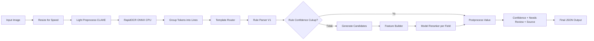
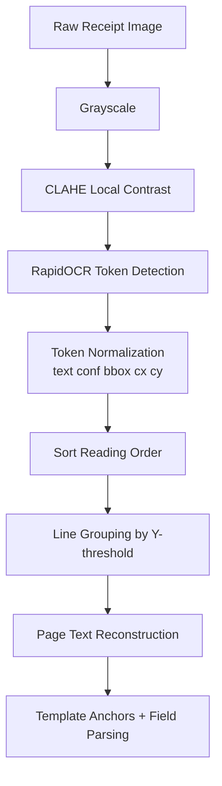
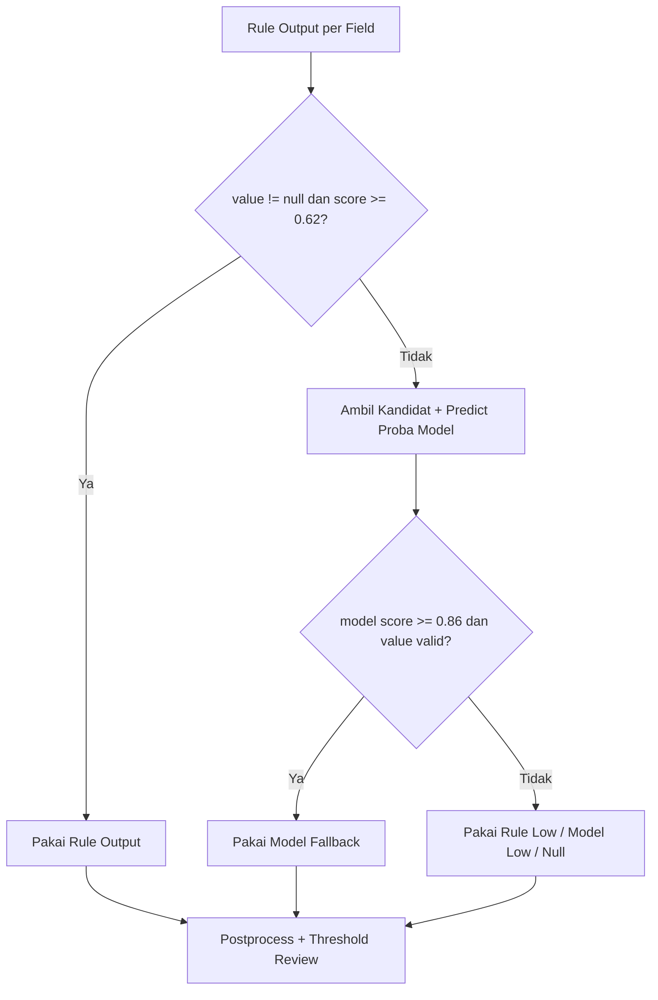
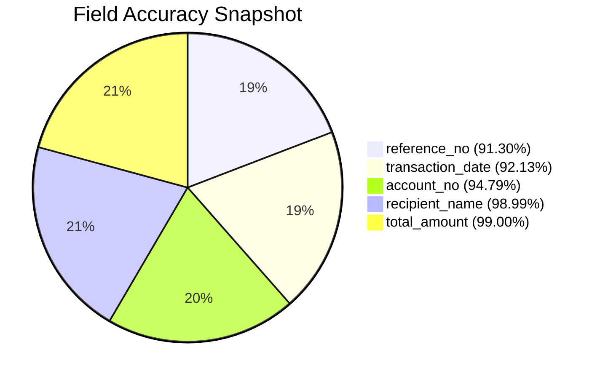
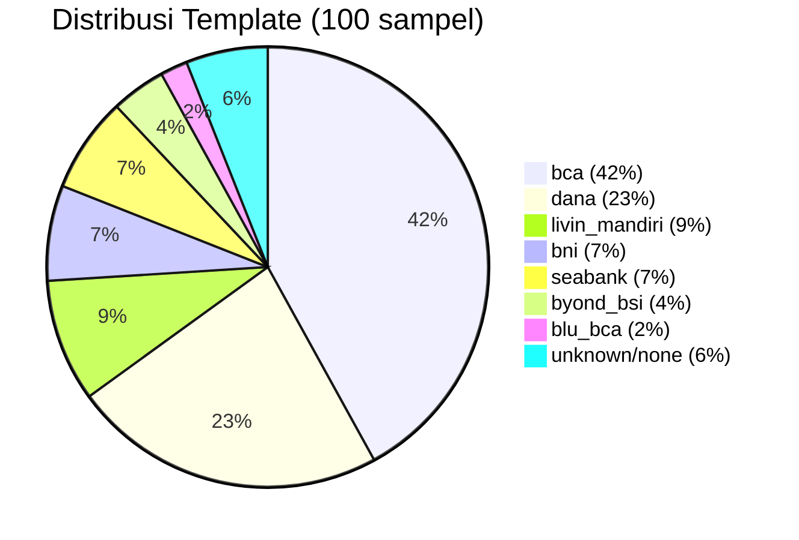

# Cetakia Field Extraction - Best Model V2

Dokumentasi ini menjelaskan arsitektur, alur kerja, evaluasi, dan insight teknis project **Best Model V2** untuk ekstraksi field bukti transfer/receipt.

## 1) Ringkasan

Best Model V2 adalah extractor receipt berbasis:

- **Rule-first parser** (utama, cepat, explainable)
- **Model reranker per-field** (fallback saat rule lemah/kosong)
- **Single-pass OCR** (mengurangi bottleneck latency)

Field target:

- `reference_no`
- `transaction_date`
- `account_no`
- `recipient_name`
- `total_amount`

Target operasional (lihat `src_v2/config.py`):

- Akurasi field minimal: `0.90`
- Latency target: `< 1.00s`

---

## 2) Struktur Project

```text
cetakia-field-extraction-v2/
├── data/
│   ├── ground_truth.jsonl
│   └── images/                     # tidak di-track git
├── artifacts_v2/
│   ├── models/                     # model joblib per-field
│   └── runtime/uploads/            # upload sementara API
├── src_v2/
│   ├── api_v2.py
│   ├── inference_v2.py
│   ├── train_v2.py
│   ├── evaluate_v2.py
│   ├── evaluate_v2_visualization.ipynb
│   ├── rule_parser_v1.py
│   ├── candidate_generator.py
│   ├── feature_builder.py
│   ├── template_router.py
│   ├── ocr_engine.py
│   ├── image_preprocess.py
│   └── layout_parser.py
└── requirements.txt
```

---

## 3) Arsitektur End-to-End

### 3.1 Inference Pipeline



### 3.2 Alur OCR dan Layout Understanding



### 3.3 Logika Rule vs Model Fallback



---

## 4) Komponen Utama

### OCR & Preprocess

- `src_v2/image_preprocess.py`
- `src_v2/ocr_engine.py`

Fungsi utama:

- Resize maksimal lebar (`OCR_MAX_WIDTH=1100`) untuk tradeoff speed/akurasi.
- Preprocess ringan (grayscale + CLAHE), sengaja tidak heavy thresholding.
- OCR engine: `rapidocr-onnxruntime` CPU-only, thread dibatasi (`OCR_CPU_THREADS=1`) untuk stabilitas latency.

### Layout & Template

- `src_v2/layout_parser.py`: normalisasi text/number, sort reading order, grouping token ke baris.
- `src_v2/template_router.py`: deteksi template berbasis anchor brand + context (mis. `bca`, `dana`, `seabank`, `livin_mandiri`, dll).

### Rule Parser (Primary Extractor)

- `src_v2/rule_parser_v1.py`

Karakteristik:

- Heuristik per-field yang robust terhadap noise OCR.
- Parser tanggal noisy (`parse_noisy_transaction_date`, `safe_parse_date`).
- Parser nominal rupiah OCR-aware.
- Mapping `account_no <-> recipient_name` dari ground truth historis untuk koreksi.
- Confidence per-field dari rule logic.

### Candidate + Feature + Reranker (Fallback)

- `src_v2/candidate_generator.py`: membentuk kandidat per field (anchor-based + direct pattern).
- `src_v2/feature_builder.py`: 24 fitur numerik (posisi bbox, pola karakter, anchor hit, source type, template id).
- `src_v2/train_v2.py`: melatih `HistGradientBoostingClassifier` per field.

Model artifact:

- `artifacts_v2/models/reference_no.joblib`
- `artifacts_v2/models/transaction_date.joblib`
- `artifacts_v2/models/account_no.joblib`
- `artifacts_v2/models/recipient_name.joblib`
- `artifacts_v2/models/total_amount.joblib`

---

## 5) Setup dan Menjalankan

### 5.1 Install Dependency

```bash
python -m venv .venv
source .venv/bin/activate
pip install -r requirements.txt
```

### 5.2 Training Ulang Model V2

```bash
python src_v2/train_v2.py
```

Output model tersimpan di `artifacts_v2/models/`.

### 5.3 Inference Satu Gambar

```bash
python - <<'PY'
from src_v2.inference_v2 import ReceiptFieldExtractorV2
import json

extractor = ReceiptFieldExtractorV2()
result = extractor.predict("data/images/1.jpg", return_meta=True)
print(json.dumps(result, indent=2, ensure_ascii=False))
PY
```

### 5.4 Evaluasi Dataset

```bash
python src_v2/evaluate_v2.py
python src_v2/evaluate_v2.py --json
```

### 5.5 Jalankan API

```bash
uvicorn src_v2.api_v2:app --host 0.0.0.0 --port 8000
```

Health check:

```bash
curl http://localhost:8000/health
```

Ekstraksi:

```bash
curl -X POST "http://localhost:8000/extract" \
  -H "X-API-Key: YOUR-API-KEY" \
  -F "file=@data/images/1.jpg"
```

Catatan keamanan: default API key di kode hanya untuk dev lokal. Untuk production, wajib override `MODEL_API_KEY` via environment variable.

---

## 6) Snapshot Evaluasi Aktual (Run Lokal)

Tanggal run: **21 Mei 2026**  
Command: `python src_v2/evaluate_v2.py --json`  
Jumlah sampel: **100**

### 6.1 Akurasi per Field

| Field | Correct/Total | Accuracy |
|---|---:|---:|
| `reference_no` | 63/69 | 91.30% |
| `transaction_date` | 82/89 | 92.13% |
| `account_no` | 91/96 | 94.79% |
| `recipient_name` | 98/99 | 98.99% |
| `total_amount` | 99/100 | 99.00% |

**Overall accuracy:** `95.58%`

### 6.2 Latency

| Metric | Value |
|---|---:|
| Mean | 0.9326 s |
| P95 | 1.5696 s |
| Max | 1.9237 s |

### 6.3 Visualisasi Evaluasi





---

## 7) Insight Operasional yang Penting

### 7.1 Sumber Prediksi per Field (100 sampel)

- `reference_no`: `rules_v1` dominan (76), namun masih ada `none` (18) dan fallback rendah (3).
- `transaction_date`: mayoritas `rules_v1` (87), `none` masih muncul (12).
- `account_no`: `rules_v1` (93), `none` (7).
- `recipient_name` dan `total_amount`: 100% dari `rules_v1`.

### 7.2 Review Rate (berdasarkan confidence threshold)

| Field | Needs Review Rate |
|---|---:|
| `reference_no` | 22.0% |
| `transaction_date` | 12.0% |
| `account_no` | 8.0% |
| `recipient_name` | 1.0% |
| `total_amount` | 0.0% |

Implikasi:

- Bottleneck kualitas terbesar ada di `reference_no` dan `transaction_date`.
- `recipient_name` + `total_amount` sudah sangat stabil untuk auto-fill.

### 7.3 Pola Error Dominan

- `reference_no` salah merge/salah potong pada string panjang (UUID/alphanumeric).
- `transaction_date` kadang salah jam/tanggal saat OCR noisy (contoh pergeseran `00:00`, day shift).
- `account_no` miss pada format masked atau layout tertentu.

---

## 8) Contoh Output Inference (`return_meta=True`)

```json
{
  "data": {
    "reference_no": null,
    "transaction_date": "2026-04-01 00:14",
    "account_no": "7425252836",
    "recipient_name": "Fadhil Bawazier",
    "total_amount": 113000
  },
  "confidence": {
    "reference_no": 0.0,
    "transaction_date": 0.91,
    "account_no": 0.98,
    "recipient_name": 0.92,
    "total_amount": 0.84
  },
  "needs_review": {
    "reference_no": true,
    "transaction_date": false,
    "account_no": false,
    "recipient_name": false,
    "total_amount": false
  },
  "source": {
    "reference_no": "none",
    "transaction_date": "rules_v1",
    "account_no": "rules_v1",
    "recipient_name": "rules_v1",
    "total_amount": "rules_v1"
  },
  "template": "bca",
  "template_score": 0.85,
  "latency_seconds": 1.1227
}
```

---

## 9) Rekomendasi Prioritas Improvement

1. Perkuat parser `reference_no` untuk multi-line UUID/alphanumeric + anti-noise account/date overlap.
2. Tambah heuristik jam valid (`transaction_date`) untuk kasus OCR fused/noisy time.
3. Tambah bank/template anchor baru pada `template_router.py` untuk menurunkan `template=None`.
4. Gunakan output notebook `src_v2/evaluate_v2_visualization.ipynb` secara periodik untuk monitoring drift.

---

## 10) Catatan Tambahan

- File besar image dan runtime upload memang di-ignore oleh git (`.gitignore`).
- Notebook evaluasi visual tersedia di `src_v2/evaluate_v2_visualization.ipynb`.
- Semua path penting sudah dikonfigurasi terpusat di `src_v2/config.py`.

