# Cetakia Field Extraction - Best Model V2

Dokumentasi ini merangkum arsitektur, alur inference, evaluasi, dan update perbaikan terbaru untuk ekstraksi field dari bukti transfer/receipt.

## 1) Ringkasan

Best Model V2 menggunakan pendekatan:

- Rule-first parser sebagai jalur utama (cepat, explainable, stabil)
- Model reranker per-field sebagai fallback saat rule lemah/kosong
- Single-pass OCR untuk menjaga latency tetap efisien

Field target:

- `reference_no`
- `transaction_date`
- `account_no`
- `recipient_name`
- `total_amount`

## 2) Struktur Project

```text
cetakia-field-extraction-v2/
├── data/
│   └── ground_truth.jsonl
├── artifacts_v2/
│   └── models/
├── src_v2/
│   ├── api_v2.py
│   ├── inference_v2.py
│   ├── rule_parser_v1.py
│   ├── candidate_generator.py
│   ├── feature_builder.py
│   ├── template_router.py
│   ├── ocr_engine.py
│   ├── image_preprocess.py
│   ├── layout_parser.py
│   ├── train_v2.py
│   ├── evaluate_v2.py
│   └── evaluate_v2_visualization.ipynb
└── requirements.txt
```

## 3) Arsitektur End-to-End

```mermaid
flowchart LR
    A[Input Image] --> B[Resize for Speed]
    B --> C[Light Preprocess]
    C --> D[RapidOCR ONNX CPU]
    D --> E[Group Tokens Into Lines]
    E --> F[Template Router]
    F --> G[Rule Parser V1]
    G --> H{Rule Kuat?}
    H -- Ya --> I[Postprocess Value]
    H -- Tidak --> J[Candidate Generator]
    J --> K[Feature Builder]
    K --> L[Model Reranker per Field]
    L --> I
    I --> M[Confidence + Source + Needs Review]
    M --> N[Final JSON]
```



## 4) Update Perbaikan Terbaru (25-28 Mei 2026)

Fokus update: menaikkan akurasi rule parser untuk kasus hard OCR tanpa mengubah fondasi pipeline.

### 4.1 Penguatan `transaction_date`

- Menambah deteksi konteks tanggal untuk format fused OCR, contoh `08April2026,17:35:54WIB`.
- Menambah filter status-bar time di baris paling atas agar waktu seperti `17.36`, `21.29`, `1.42` tidak dipakai sebagai waktu transaksi.
- Menambah pemilihan kandidat waktu berbasis kedekatan dengan baris tanggal/anchor (`tanggal`, `waktu`, `WIB`).
- Menambah selective raw OCR retry untuk `transaction_date` saat hasil preprocess kosong atau lemah.

### 4.2 Penguatan `reference_no`

- Menambah merge multi-line alphanumeric/UUID agar mendukung 2 baris atau lebih dari 2 baris.
- Menambah dedup segmen saat merge supaya tidak mengulang token baris sebelumnya.
- Memperketat noise filter agar baris rekening (`No.Rek.*`, `rekening tujuan/asal/penerima`) tidak salah masuk ke `reference_no`.
- Menambah selective raw OCR retry `reference_no` berbasis anchor (`No. Ref`, `Ref ID`, `No. Transaksi`, `Biz ID`) saat skor awal rendah.

### 4.3 Stabilitas Inference

- Rule output tetap menjadi prioritas utama.
- Retry raw OCR hanya dipanggil selektif pada field yang memang lemah/kosong agar peningkatan akurasi tetap efisien terhadap latency.

## 5) Status Hard Cases

### 5.1 Batch Hard Cases Awal

Seluruh hard cases awal tetap terjaga sesuai ground truth:

- `33.jpg` (Seabank): `reference_no` panjang berhasil diambil, `account_no` dan `recipient_name` penerima benar.
- `311.jpeg` (DANA): `account_no` dari `Akun DANA` terisi, `recipient_name` terkoreksi.
- `61.jpg`: `reference_no` dipaksa `null`, `account_no` dan `recipient_name` bersih.
- `39.jpg`: `reference_no` `null`, `transaction_date` terkoreksi dari blok tanggal transaksi.
- `5.jpg`: `reference_no` `null`, `transaction_date` tepat.

### 5.2 Batch Debugging Lanjutan (Receipt 28/32/34/65/77/85/121)

Semua kasus berikut sudah sesuai ekspektasi debugging:

- `28.jpg` (wondr BNI): `transaction_date` tidak lagi `null`, sekarang `2026-04-02 19:09` dari baris tanggal di atas `Ref ID`.
- `34.jpg` (BRI): `reference_no` terisi dari `No. Ref` menjadi `119942982752` (tidak lagi `null`).
- `32.jpg` (BCA): `reference_no` multi-line terkoreksi menjadi `B9C62C15-CF2A-4837-8D93-E87E7E791B80` (tidak lagi duplikasi segmen line 2).
- `85.jpg` (BRI): waktu `transaction_date` terkoreksi ke waktu struk (`17:35`), bukan status bar (`17:36`).
- `121.jpg`: `reference_no` dipaksa `null` karena tidak ada reference valid, mencegah over-extract dari `No.Rek.Tujuan`.
- `77.jpg` (Jago): waktu `transaction_date` terkoreksi ke `21:28` dari isi receipt, bukan status bar `21:29`.
- `65.jpg` (BNI): waktu `transaction_date` terkoreksi ke `13:42` dari `Waktu Transaksi`, bukan `1:42` status bar.

## 6) Snapshot Evaluasi Terbaru (Rerun Notebook)

Sumber metrik:

- `artifacts_v2/evaluation_visuals_v2/summary_100.json` (hasil terbaru).
- `artifacts_v2/evaluation_visuals_v2/baseline_summary_100.json` (sebelum hard-case debugging).

Command evaluasi:

```bash
python -m src_v2.evaluate_v2 --json
```

Hasil terbaru (100 sampel, rerun 28 Mei 2026):

- Overall accuracy: **98.90%**.
- `reference_no`: **98.55%** (68/69).
- `transaction_date`: **96.63%** (86/89).
- `account_no`: **100.00%** (96/96).
- `recipient_name`: **100.00%** (99/99).
- `total_amount`: **99.00%** (99/100).
- Latency mean: **1.0987s**.
- Latency median: **1.1098s**.
- Latency P90: **1.8889s**.
- Latency P95: **2.2983s**.
- Latency P99: **2.8193s**.
- Latency max: **2.8633s**.
- Rasio inferensi <1 detik: **40%**.

Dampak dibanding baseline (100 sampel):

- Overall accuracy naik **+13.47 poin** (85.43% -> 98.90%).
- `transaction_date` naik **+28.09 poin** (68.54% -> 96.63%).
- `reference_no` naik **+23.19 poin** (75.36% -> 98.55%).
- `recipient_name` naik **+10.10 poin** (89.90% -> 100.00%).
- `account_no` naik **+7.29 poin** (92.71% -> 100.00%).
- `total_amount` naik **+3.00 poin** (96.00% -> 99.00%).
- Mean latency membaik **-0.2758s** (1.3745s -> 1.0987s).
- P95 latency naik **+0.1766s** (2.1217s -> 2.2983s), sehingga tail-latency masih perlu optimasi.

## 7) Notebook Evaluasi Visual

Notebook: `src_v2/evaluate_v2_visualization.ipynb`

Artefak visual yang dihasilkan saat rerun:

- `artifacts_v2/evaluation_visuals_v2/chart_field_accuracy_100.png`.
- `artifacts_v2/evaluation_visuals_v2/chart_latency_100.png`.
- `artifacts_v2/evaluation_visuals_v2/chart_template_field_heatmap_100.png`.
- `artifacts_v2/evaluation_visuals_v2/row_level_100.csv`.
- `artifacts_v2/evaluation_visuals_v2/field_level_100.csv`.
- `artifacts_v2/evaluation_visuals_v2/summary_100.json`.

Notebook dipakai untuk:

- Verifikasi per-field di hard cases.
- Monitoring backlog row-level dengan akurasi terendah.
- Memastikan peningkatan akurasi tidak mengorbankan stabilitas latency.

## 8) Menjalankan Project

### 8.1 Install dependency

```bash
python -m venv .venv
source .venv/bin/activate
pip install -r requirements.txt
```

### 8.2 Train ulang model fallback

```bash
python src_v2/train_v2.py
```

### 8.3 Inference satu gambar

```bash
python - <<'PY'
from src_v2.inference_v2 import ReceiptFieldExtractorV2
import json

extractor = ReceiptFieldExtractorV2()
result = extractor.predict("data/images/1.jpg", return_meta=True)
print(json.dumps(result, indent=2, ensure_ascii=False))
PY
```

### 8.4 Evaluasi

```bash
python src_v2/evaluate_v2.py
python src_v2/evaluate_v2.py --json
```

### 8.5 Jalankan API

```bash
uvicorn src_v2.api_v2:app --host 0.0.0.0 --port 8000
```

Contoh request:

```bash
curl -X POST "http://localhost:8000/extract" \
  -H "X-API-Key: YOUR-API-KEY" \
  -F "file=@data/images/1.jpg"
```

## 9) Prioritas Lanjutan

1. Optimasi latency mean/p95 tanpa menurunkan akurasi hard cases
2. Penguatan parser `transaction_date` untuk kasus OCR day-shift/jam ambigu
3. Penguatan parser `reference_no` pada pola UUID/alphanumeric yang terpotong
4. Evaluasi template drift berkala memakai notebook visual

## 10) Konsistensi Environment (Penting)

Perbedaan hasil evaluasi antara env `base` dan env lain (misalnya `cetakia`) biasanya berasal dari **mismatch dependency runtime vs artifact model**.

Contoh gejala:

- Muncul `InconsistentVersionWarning` dari `scikit-learn` saat load `*.joblib`
- Akurasi turun walaupun kode sama

Mulai versi ini, `inference_v2.py` akan **fail-fast** jika model artifact tidak kompatibel (kecuali `ALLOW_MODEL_VERSION_MISMATCH=1`).

Untuk hasil yang konsisten dengan baseline optimal:

1. Gunakan Python `>=3.11`
2. Install dependency lock:
   - `pip install -r requirements.txt`
   - atau recreate env langsung dari lock file:
     - `conda env remove -n cetakia -y`
     - `conda env create -f environment.cetakia.lock.yml`
3. Jalankan evaluasi ulang:
   - `python src_v2/evaluate_v2.py`

Jika tetap memakai Python 3.10, jangan pakai artifact model yang ditrain di `scikit-learn==1.8.0`; lakukan retrain di env aktif.

## 11) Catatan

- API key default pada kode hanya untuk development lokal.
- Untuk production, wajib override `MODEL_API_KEY` via environment variable.
- Path konfigurasi penting terpusat di `src_v2/config.py`.
