# Cetakia Field Extraction - Best Model V2

Dokumentasi ini merangkum arsitektur, alur inference, evaluasi, dan update perbaikan terbaru untuk ekstraksi field dari bukti transfer/receipt.

## 1) Ringkasan

Best Model V2 menggunakan pendekatan:

- Rule-first parser sebagai jalur utama (cepat, explainable, stabil)
- Model reranker per-field sebagai fallback saat rule lemah/kosong
- Single-pass OCR untuk menjaga latency tetap efisien

Field target:

- `reference_no`
- `transaction_date`
- `account_no`
- `recipient_name`
- `total_amount`

## 2) Struktur Project

```text
cetakia-field-extraction-v2/
├── data/
│   └── ground_truth.jsonl
├── artifacts_v2/
│   └── models/
├── src_v2/
│   ├── api_v2.py
│   ├── inference_v2.py
│   ├── rule_parser_v1.py
│   ├── candidate_generator.py
│   ├── feature_builder.py
│   ├── template_router.py
│   ├── ocr_engine.py
│   ├── image_preprocess.py
│   ├── layout_parser.py
│   ├── train_v2.py
│   ├── evaluate_v2.py
│   └── evaluate_v2_visualization.ipynb
└── requirements.txt
```

## 3) Arsitektur End-to-End

```mermaid
flowchart LR
    A[Input Image] --> B[Resize for Speed]
    B --> C[Light Preprocess]
    C --> D[RapidOCR ONNX CPU]
    D --> E[Group Tokens Into Lines]
    E --> F[Template Router]
    F --> G[Rule Parser V1]
    G --> H{Rule Kuat?}
    H -- Ya --> I[Postprocess Value]
    H -- Tidak --> J[Candidate Generator]
    J --> K[Feature Builder]
    K --> L[Model Reranker per Field]
    L --> I
    I --> M[Confidence + Source + Needs Review]
    M --> N[Final JSON]
```



## 4) Update Perbaikan Terbaru (25-26 Mei 2026)

Fokus update: meningkatkan akurasi 5 hard cases tanpa mengubah fondasi pipeline secara besar.

### 4.1 Rule dan Parser yang Ditambahkan/Disempurnakan

- Perluasan anchor `reference_no`:
  - dukung `no transaksi`, `no. transaksi`, `no.transaksi`, `transaction reference`, `reference`
- Penguatan filter noise `reference_no`:
  - blok pola account-like (`Bank...-7425...`) agar tidak salah masuk reference
  - blok token fee/amount (`RP/IDR`, `fee`, `debit amount`) agar tidak jadi reference
- Perbaikan DANA parser:
  - `account_no` mendukung anchor `Akun DANA`
  - `recipient_name` support masked-name resolution via lexicon (contoh `Si Nur..lah` -> `Siti Nurjamilah`)
- Perbaikan fallback resolver di inference:
  - low-confidence `reference_no` dari model fallback tidak lagi memaksa output noise
- Penambahan selective raw OCR retry untuk Seabank:
  - dipicu hanya saat konteks `No. Transaksi` ada dan reference awal lemah/noisy
  - dipakai untuk mengekstrak nomor transaksi panjang yang tidak terbaca di pass utama

## 5) Status 5 Hard Cases

Seluruh hard cases berikut sudah ditangani dengan hasil sesuai ground truth:

1. `33.jpg` (Seabank)
- `reference_no`: sekarang mengambil nomor transaksi panjang (`2026040343505101608027237`)
- `account_no` dan `recipient_name`: sekarang mengambil penerima (`7425252836`, `Fadhil Bawazier`)

2. `311.jpeg` (DANA)
- `account_no`: terisi dari `Akun DANA` (`081292019395`)
- `recipient_name`: terkoreksi menjadi `Siti Nurjamilah`

3. `61.jpg`
- `reference_no`: dipaksa `null` karena tidak ada referensi valid
- `account_no`: terkoreksi ke rekening penerima (`7425252836`)
- `recipient_name`: bersih dari over-extract (`Fadhil Bawazier`)

4. `39.jpg`
- `reference_no`: `null` (tidak ada reference valid)
- `transaction_date`: waktu terkoreksi dari blok tanggal di bawah `Transfer Berhasil` (`2026-04-03 15:03`)

5. `5.jpg`
- `reference_no`: `null` (tidak ada reference valid)
- `transaction_date`: waktu tepat (`2026-04-01 14:45`)

## 6) Snapshot Evaluasi Terbaru

Tanggal run: **26 Mei 2026**  
Command:

```bash
python -m src_v2.evaluate_v2 --json
```

Hasil (100 sampel):

- Overall accuracy: **96.91%**
- Per-field:
  - `reference_no`: **95.65%** (66/69)
  - `transaction_date`: **93.26%** (83/89)
  - `account_no`: **95.83%** (92/96)
  - `recipient_name`: **100.00%** (99/99)
  - `total_amount`: **99.00%** (99/100)
- Latency:
  - Mean: **1.2459s**
  - P95: **2.1209s**
  - Max: **3.1946s**

Catatan:
- Akurasi sudah meningkat signifikan, terutama pada hard cases yang menjadi target debugging.
- Latency masih di atas target ideal `< 1.0s` untuk mean/p95, sehingga optimasi performa tetap menjadi backlog berikutnya.

## 7) Notebook Evaluasi Visual

Notebook: `src_v2/evaluate_v2_visualization.ipynb`

Notebook sudah diperbarui agar:

- Menyertakan konteks update terbaru parser/rules
- Memantau 5 hard cases secara eksplisit (`33.jpg`, `311.jpeg`, `61.jpg`, `39.jpg`, `5.jpg`)
- Menampilkan detail match per-field untuk tiap hard case
- Tetap menyediakan backlog global (row dengan akurasi terendah) untuk prioritas lanjutan

## 8) Menjalankan Project

### 8.1 Install dependency

```bash
python -m venv .venv
source .venv/bin/activate
pip install -r requirements.txt
```

### 8.2 Train ulang model fallback

```bash
python src_v2/train_v2.py
```

### 8.3 Inference satu gambar

```bash
python - <<'PY'
from src_v2.inference_v2 import ReceiptFieldExtractorV2
import json

extractor = ReceiptFieldExtractorV2()
result = extractor.predict("data/images/1.jpg", return_meta=True)
print(json.dumps(result, indent=2, ensure_ascii=False))
PY
```

### 8.4 Evaluasi

```bash
python src_v2/evaluate_v2.py
python src_v2/evaluate_v2.py --json
```

### 8.5 Jalankan API

```bash
uvicorn src_v2.api_v2:app --host 0.0.0.0 --port 8000
```

Contoh request:

```bash
curl -X POST "http://localhost:8000/extract" \
  -H "X-API-Key: YOUR-API-KEY" \
  -F "file=@data/images/1.jpg"
```

## 9) Prioritas Lanjutan

1. Optimasi latency mean/p95 tanpa menurunkan akurasi hard cases
2. Penguatan parser `transaction_date` untuk kasus OCR day-shift/jam ambigu
3. Penguatan parser `reference_no` pada pola UUID/alphanumeric yang terpotong
4. Evaluasi template drift berkala memakai notebook visual

## 10) Konsistensi Environment (Penting)

Perbedaan hasil evaluasi antara env `base` dan env lain (misalnya `cetakia`) biasanya berasal dari **mismatch dependency runtime vs artifact model**.

Contoh gejala:

- Muncul `InconsistentVersionWarning` dari `scikit-learn` saat load `*.joblib`
- Akurasi turun walaupun kode sama

Mulai versi ini, `inference_v2.py` akan **fail-fast** jika model artifact tidak kompatibel (kecuali `ALLOW_MODEL_VERSION_MISMATCH=1`).

Untuk hasil yang konsisten dengan baseline optimal:

1. Gunakan Python `>=3.11`
2. Install dependency lock:
   - `pip install -r requirements.txt`
   - atau recreate env langsung dari lock file:
     - `conda env remove -n cetakia -y`
     - `conda env create -f environment.cetakia.lock.yml`
3. Jalankan evaluasi ulang:
   - `python src_v2/evaluate_v2.py`

Jika tetap memakai Python 3.10, jangan pakai artifact model yang ditrain di `scikit-learn==1.8.0`; lakukan retrain di env aktif.

## 11) Catatan

- API key default pada kode hanya untuk development lokal.
- Untuk production, wajib override `MODEL_API_KEY` via environment variable.
- Path konfigurasi penting terpusat di `src_v2/config.py`.
